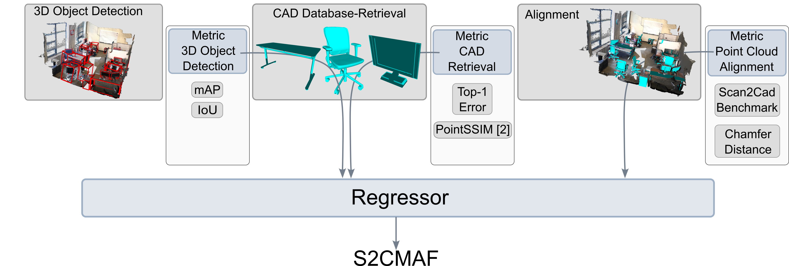

# S2CMAF



# Abstract

Scan-to-CAD-based 3D reconstruction of indoor environments has become increasingly more popular in recent years.
The inherent structure of Scan-to-CAD consists of object detection, model retrieval, and alignment.
Therefore, a variety of metrics are required to assess these three aspects.
This can lead to ambiguous evaluation results and incorrect quality assumptions.
To impede the problem of incorrect evaluation, we introduce S2CMAF, a multi-method assessment fusion approach for Scan-to-CAD pipelines.
S2CMAF merges several metrics used in evaluating these pipelines into one unique quality score.
We show that S2CMAF significantly improves the correlation between Scan-to-CAD results and the ground truth, compared to the conventionally used Scan2CAD benchmark.
Additionally, we train S2CMAF using different optimization techniques and demonstrate the advantages of our approach on real-world data.

# Citation

Please cite us using:

```tex
@inproceedings{dritonS2CMAF_2022,
	author = {Salihu, Driton and Misik, Adam and Hofbauer, Markus and Steinbach, Eckehard},
	title = {Multi-Method Assessment Fusion for Scan-to-CAD Methods},
	booktitle = {24th IEEE International Symposium on  Multimedia},
	year = {2022},
	month = {Dec},
}
```

## NEWS

- Due to deadlines the release of the code will be slightly delayed (-> until hopefully end of December)
